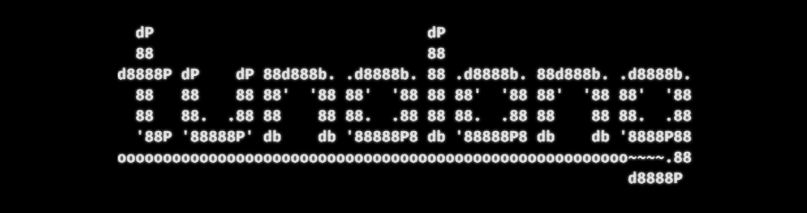

# The Tuna Programming Language


A dynamically typed, interpreted programming language.


### Supported Platforms


## Overview
**Tuna** is a dynamically typed, interpreted programming language. This project is heavily inspired by and derived from the books **'Writing An Interpreter in Go'** & **'Writing A Compiler in Go'** by **Thorsten Ball** and the *Monkey* programming language.

As of *v1.0*, the language is fully functional as interpreter and supports functionality such as
- Simple data types - **Integers**, **Strings** and **Booleans**.
- Compound data types - **Lists** and **Maps**.
- **Prefix**, **Infix** and **Index** operations.
- **Conditional** and **Return** statements.
- **Global** and **Local** variable bindings.
- **First-class** functions and **Closures**.
- Simple **Built-In** functions.

## Usage
The only way to use **Tunalang** currently is through the REPL (this will change).
1. [Install](#installation) **Tunalang** .
2. Run ``tunalang`` to start the **Tuna REPL**.
3. Code Away!

## Installation

### From Binary

1. Download the binary for the target platform from the latest release. All **Tunalang** releases are available [here](https://github.com/manishmeganathan/tunalang/releases).
2. Save the binary to a directory of choice.
3. Add the path to that directory to the ``PATH`` environment variable.
4. **Tunalang** is now install and can be invoked using the ``tunalang`` command.

Note: If a binary is not availabe for your platform. Raise an issue or install from source. Any platform that is supported by the Go runtime will support **Tuna**.

### From Source

Installing from source requires an installation of **Git** and **Go** v1.16+. An installation of **Make** is useful but not necessary. **Make** for Windows is available on Chocolatey and can be installed with ``choco install make``.  

1. Clone the repository and change directory into it.
```
git clone https://github.com/manishmeganathan/tunalang.git 
cd tunalang
```
2. Compile and Install the binary.

If the ``make`` command is available, run the following.
```
make install
```
Otherwise, run this.
```
go install .
```
3. **Tunalang** is now install and can be invoked using the ``tunalang`` command. Some platform might require a manual configuration for the Go binary source to be added to path.

## Components

### The Lexer
The lexer converts string inputs into lexicological token that can be parsed. It is defined in ``lexer`` package along with the definitions for the lexicological tokens used in Tuna.

### The Parser
The parser is a top-down recursive descent parser that is often called a **Pratt parser**. It is defined in ``parser`` package. Its role is to converts the tokens generated by the lexer into an **Abstract Syntax Tree**. The nodes of the AST are defined in the ``syntaxtree`` package.

### The Evaluator
The evaluator is a tree-walking evaluator implemented in the ``evaluator`` package that recursively walks down the AST and evaluates it into objects that are defined by ``object`` package.

### The REPL
The read-eval-print loop accepts an input and interprets/evaluates it on the fly and prints the output. It is the primary interface to interact with the **Tuna** programming language.


## Examples
```bash
let name = "Tunalang";
let inspirations = ["Monkey", "Rust", "Wren"];

let data = {
    "name": name,
    "version": "v1.0.0"
};

let printdata = fn(data) {
    let name = data["name"];
    let version = data["version"];

    puts(name + " - " + version);
};

printdata(book);
# => prints: "Tunalang - v1.0.0"
```

```bash
let fibonacci = fn(x) {
    if (x == 0) {
        0
    } else {
        if (x == 1) {
            return 1;
        } else {
            fibonacci(x - 1) + fibonacci(x - 2);
        }
    }
};

let map = fn(arr, f) {
    let iter = fn(arr, accumulated) {
        if (len(arr) == 0) {
            accumulated
        } else {
            iter(rest(arr), push(accumulated, f(first(arr))));
        }
    };
    iter(arr, []);
};

let numbers = [1, 1 + 1, 4 - 1, 2 * 2, 2 + 3, 12 / 2];
map(numbers, fibonacci);
# => returns: [1, 1, 2, 3, 5, 8]
```

## Future Development
- Unicode Lexer [[#1]](https://github.com/manishmeganathan/tunalang/issues/1)
- Macro System [[#6]](https://github.com/manishmeganathan/tunalang/issues/6)
- Bytecode Compiler and Virtual Machine (Tuna v2)
